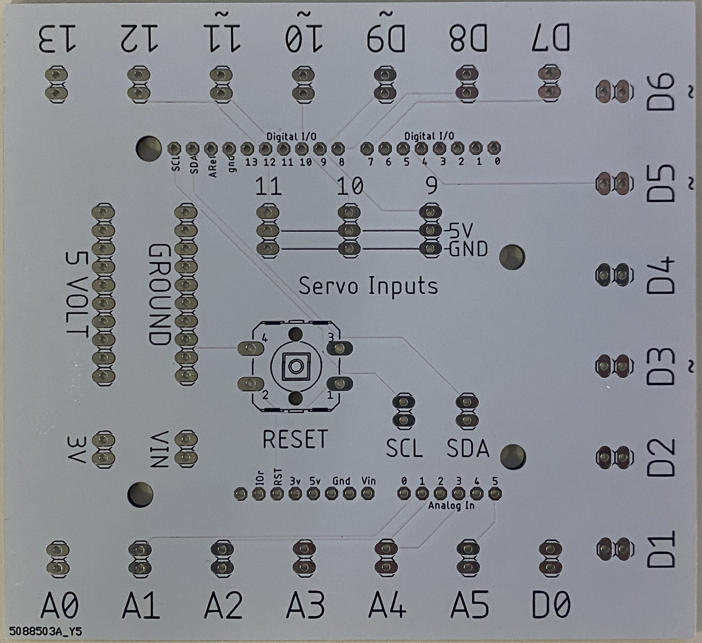
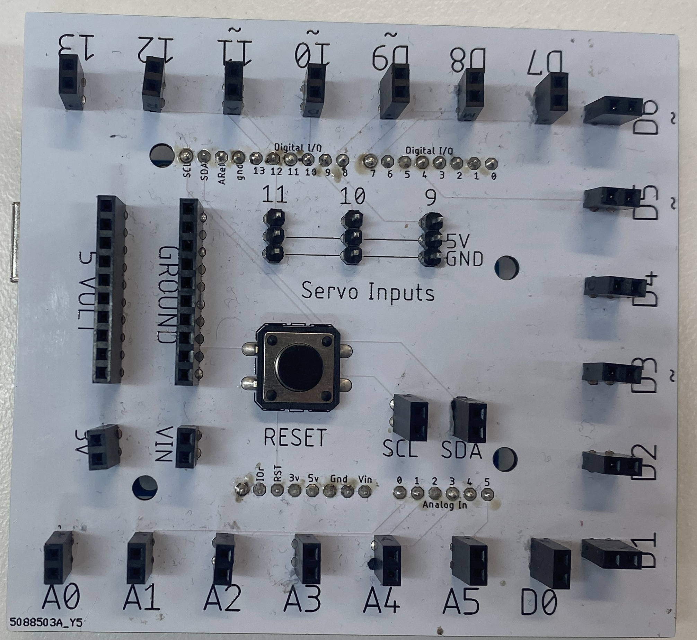
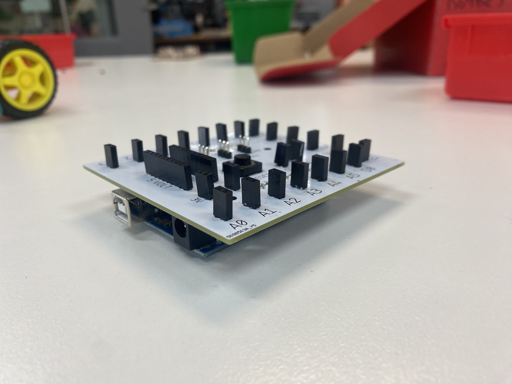

# VisionImpairedArduinoShield
An Arduino Shield designed for a vision impaired student in my robotics class.

## General Info
This was designed for a vision impaired student in my robotics class, as we decided the pin spacing on an Arduino was too close together.

Feel free to download the EAGLE files and customise it however you like.

If you just want to get one made, download the GERBER .zip file and send it right off to your preferred PCB manufacturer. (I used JLCPCB and got it made in their white soldermask with a black silkscreen to maximise contrast)

## Bill of Materials
| Part                      | Quantity | Notes                                 |
|---------------------------|----------|---------------------------------------|
| 1x2 Female Pin Header     | 24       |                                       |
| 1x3 Female Pin Header     | 3        |                                       |
| 1x10 Female Pin Header    | 2        |                                       |
| 1x32 Male Pin Header      | 1        | Broken into lengths of 10, 8, 8 and 6 |
| 12mm Tactile Switch       | 1        |                                       |

## Images

